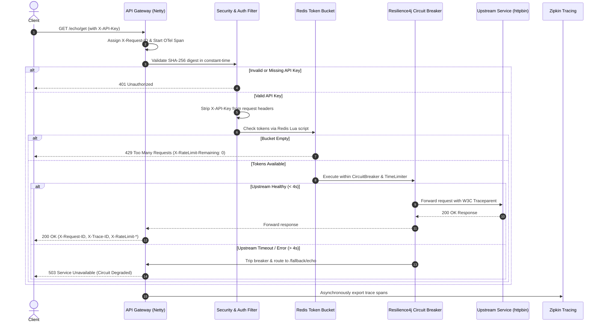

# Enterprise API Rate Limiter & Edge Gateway

An enterprise-grade, non-blocking API Rate Limiter and Edge Gateway built with **Spring Cloud Gateway (Reactive)**, **Redis (Token Bucket Algorithm)**, **Resilience4j (Circuit Breaker & TimeLimiter)**, **OpenTelemetry & Zipkin (Distributed Tracing)**, **Prometheus & Grafana (Real-Time Observability)**, and **Spring Security (Constant-Time SHA-256 API Key Authentication)**.

[](https://openjdk.org/projects/jdk/21/)
[](https://spring.io/projects/spring-boot)
[](https://spring.io/projects/spring-cloud)
[](https://redis.io/)
[](https://prometheus.io/)
[](https://grafana.com/)
[](LICENSE)

---

## Table of Contents

- [Overview & Architecture](#overview--architecture)
- [Business Logic Explained Simply](#business-logic-explained-simply)
- [Key Engineering Features](#key-engineering-features)
- [System Architecture Diagram](#system-architecture-diagram)
- [Quick Start with Docker Compose](#quick-start-with-docker-compose)
- [Step-by-Step API Testing Guide](#step-by-step-api-testing-guide)
- [Distributed Tracing & Zipkin](#distributed-tracing--zipkin)
- [Production Observability: Prometheus & Grafana](#production-observability-prometheus--grafana)
- [Automated Load Testing Suite (k6)](#automated-load-testing-suite-k6)
- [Redis High Availability (Sentinel Failover)](#redis-high-availability-sentinel-failover)
- [Configuration Reference](#configuration-reference)
- [Generating API Keys and Hashes](#generating-api-keys-and-hashes)
- [Project Directory Structure](#project-directory-structure)
- [Automated Testing & Quality Suite](#automated-testing--quality-suite)
- [Deep-Dive Documentation](#deep-dive-documentation)

---

## Overview & Architecture

Modern distributed systems and microservice architectures face significant reliability threats:
1. **Noisy Neighbor Problems**: A single tenant can overwhelm shared downstream microservices with runaway traffic.
2. **Cascading Failures**: Slow downstream APIs cause connection pool exhaustion, starving the entire platform.
3. **Credential Sprawl & Leaks**: Upstream services accidentally receiving, caching, or logging plaintext API keys.
4. **Single Points of Failure**: In-memory or standalone state stores crashing, bringing down traffic ingress.
5. **Visibility Blindspots**: Lack of cross-service correlation identifiers when tracking distributed latency spikes.

This gateway acts as an intelligent protective shield positioned in front of your microservices, delivering sub-millisecond rate enforcement, fault isolation, and full lifecycle request observability without blocking OS threads.

---

## Business Logic Explained Simply

### 1. The Token Bucket Metaphor (Rate Limiting)
Imagine a movie theater entrance that accepts a maximum flow of visitors:
- Every tenant receives their own **bucket** that can hold up to **10 tokens** (`burstCapacity = 10`).
- Every second, an automatic dispenser adds **5 new tokens** to the bucket (`replenishRate = 5`).
- When a user makes an API call, they must hand over **1 token** to pass.
- If requests arrive at a steady 5 requests/sec, the bucket never runs out.
- If a burst of 10 requests arrives simultaneously, all 10 are served immediately by consuming the reserve tokens.
- Any request arriving while the bucket is completely empty is immediately turned away with **`429 Too Many Requests`**.

### 2. The Circuit Breaker Metaphor (Fault Tolerance)
Like an electrical circuit breaker in your home that trips when current spikes to prevent a fire:
- **CLOSED (Normal State)**: Requests flow freely to the downstream service. The gateway tracks success/failure rates over a sliding window of the last 10 requests.
- **OPEN (Tripped State)**: If 50% or more calls fail or take longer than 4.0 seconds to respond, the breaker trips **OPEN**. Rather than letting requests pile up and hang your infrastructure, the gateway instantly fast-fails all subsequent traffic in sub-20ms with a structured **`503 Service Unavailable`** fallback.
- **HALF-OPEN (Testing Recovery)**: After a cooling period (10 seconds), the circuit allows a small number of trial requests through. If they succeed, the breaker resets to **CLOSED**. If any fail, it stays **OPEN**.

### 3. Zero-Trust Key Hashing (Constant-Time Security)
- **Why hashes?** We never store, compare, or transmit plaintext API keys. Only the cryptographic **SHA-256 digest** is configured in the gateway.
- **Why constant-time comparison?** Standard text comparisons (`stringA == stringB`) exit early on the first mismatched letter. Malicious actors can measure nanosecond differences in server response times to guess keys character-by-character (a *timing attack*). We compare hashes using `MessageDigest.isEqual()`, which takes the exact same number of CPU cycles regardless of whether zero or all bytes match.
- **Upstream Credential Stripping**: The gateway authenticates the client at the edge and deletes the `X-API-Key` header before proxying the request downstream. Internal microservices never see or log API keys.

---

## Key Engineering Features

- **Non-Blocking Reactive Engine**: Powered by Spring Cloud Gateway on Netty and Project Reactor. Thousands of concurrent requests are handled by a small, fixed number of event-loop threads.
- **Atomic Distributed Rate Limiting**: Token bucket state is maintained in Redis using atomic **Lua scripts**, ensuring consistency even when the gateway is scaled horizontally across multiple instances.
- **Redis High Availability (Sentinel)**: 5-node fault-tolerant topology with automated leader election, master-replica replication, and zero-downtime client failover via Lettuce.
- **Two-Layer Timeout Defense**:
  - *Layer 1*: Reactor Netty HTTP client response timeout ceiling (5,000ms).
  - *Layer 2*: Resilience4j TimeLimiter (4,000ms) tightly coupled with the Circuit Breaker.
- **Distributed Tracing & Context Propagation**:
  - Implements **Micrometer Tracing** with the **OpenTelemetry** bridge and **Zipkin** reporter.
  - Automatically preserves trace context across Netty thread switches via `Hooks.enableAutomaticContextPropagation()`.
  - Stamps inbound and outbound requests with W3C-compliant `traceparent` headers and echoes `X-Request-ID` and `X-Trace-ID` on all client responses.
- **Production Observability (Prometheus & Grafana)**:
  - Publishes SLA histogram distributions and percentiles (p50, p95, p99) to `/actuator/prometheus`.
  - Auto-provisioned Grafana dashboards tracking live throughput, 429 drops, circuit breaker states, and JVM resource limits.
- **Hardened Actuator & Role-Based Access Control**:
  - Unauthenticated clients see only minimal health status (`{"status":"UP"}`).
  - Detailed component health, Prometheus metrics, and circuit breaker events are restricted to users with the `ROLE_ACTUATOR` role over HTTP Basic Auth.

---

## System Architecture Diagram



---

## Quick Start with Docker Compose

### Prerequisites
- [Docker](https://docs.docker.com/get-docker/) (Engine 24+)
- [Docker Compose](https://docs.docker.com/compose/) (v2+)
- *Optional for local development*: Java 21 JDK and Maven 3.9+

### 1. Clone & Configure Secrets
Clone the repository and initialize your local environment configuration:

```bash
git clone https://github.com/ramantiw45/api-rate-limiter.git
cd api-rate-limiter

# Copy template secrets
cp .env.example .env
```

The preconfigured `.env` comes ready out-of-the-box with development credentials:
- **Default API Key**: `my-secure-api-key`
- **Actuator Username**: `actuator`
- **Actuator Password**: `SuperSecretActuatorPass123!`

### 2. Build and Start the Entire Stack
Run Docker Compose in detached mode:

```bash
docker compose up --build -d
```

### 3. Verify Container Health
Check that all containers are healthy:

```bash
docker compose ps
```

Expected output:
```
NAME                      IMAGE                      STATUS                    PORTS
rate-limiter-gateway      api-rate-limiter-gateway   Up (healthy)              0.0.0.0:8080->8080/tcp
rate-limiter-redis        redis:7-alpine             Up (healthy)              0.0.0.0:6379->6379/tcp
rate-limiter-zipkin       openzipkin/zipkin:3        Up (healthy)              0.0.0.0:9411->9411/tcp
rate-limiter-prometheus   prom/prometheus:v2.54.1    Up                        0.0.0.0:9090->9090/tcp
rate-limiter-grafana      grafana/grafana:11.2.0     Up                        0.0.0.0:3000->3000/tcp
```

---

## Step-by-Step API Testing Guide

### 1. Happy Path Request (200 OK)
Send an authenticated request through the gateway to the `/echo/**` route:

```bash
curl -i -H "X-API-Key: my-secure-api-key" http://localhost:8080/echo/get
```

**Expected Response Headers & Body**:
```http
HTTP/1.1 200 OK
X-RateLimit-Remaining: 9
X-RateLimit-Requested-Tokens: 1
X-RateLimit-Burst-Capacity: 10
X-RateLimit-Replenish-Rate: 5
X-Request-ID: 1aad7a23-88b4-4f28-be0b-f2fac98aeeb2
X-Trace-ID: 4a3bfbcc4a31cbf2dbacf63800e65da7
Content-Type: application/json

{
  "headers": {
    "Traceparent": "00-4a3bfbcc4a31cbf2dbacf63800e65da7-67db477f5c78ca1c-01"
  },
  "url": "https://localhost:8080/get"
}
```

---

### 2. Rate Limiting in Action (429 Too Many Requests)
Simulate a burst of requests exceeding the bucket capacity (10 tokens):

```bash
# Rapidly fire 15 requests
for i in {1..15}; do
  curl -s -o /dev/null -w "%{http_code}\n" -H "X-API-Key: my-secure-api-key" http://localhost:8080/echo/get
done
```

**Output**:
```
200
200
... (10 requests succeed)
429
429
... (remaining requests rejected)
```

**Inspecting the 429 Error Body**:
```bash
curl -i -H "X-API-Key: my-secure-api-key" http://localhost:8080/echo/get
```
```http
HTTP/1.1 429 Too Many Requests
X-RateLimit-Remaining: 0
Retry-After: 1
Content-Type: application/json

{
  "error": "TOO_MANY_REQUESTS",
  "message": "Token bucket depleted. Please back off before retrying.",
  "status": 429,
  "timestamp": "2026-09-05T17:15:00Z"
}
```

---

### 3. Authentication & Security Enforcement (401 Unauthorized)
Attempt an unauthenticated request without an API key:

```bash
curl -i http://localhost:8080/echo/get
```
```http
HTTP/1.1 401 Unauthorized
Content-Type: application/json

{
  "error": "UNAUTHORIZED",
  "message": "Missing or invalid API key.",
  "status": 401
}
```

Attempt with a forged or tampered API key:
```bash
curl -i -H "X-API-Key: malicious-attacker-key" http://localhost:8080/echo/get
```
```http
HTTP/1.1 401 Unauthorized
```

---

### 4. Circuit Breaker & Timeout Tripping (503 Service Unavailable)
Call an upstream endpoint that delays for 5 seconds (exceeding our 4,000ms TimeLimiter threshold):

```bash
curl -i -H "X-API-Key: my-secure-api-key" http://localhost:8080/echo/delay/5
```

**Result**: At exactly 4,000ms, the TimeLimiter interrupts the call and invokes the local fallback controller:
```http
HTTP/1.1 503 Service Unavailable
Content-Type: application/json

{
  "error": "SERVICE_DEGRADED",
  "message": "The downstream service is currently slow or unavailable. Fallback response served.",
  "status": 503,
  "timestamp": "2026-09-05T17:16:30Z"
}
```

Repeat 5 times to exceed the `failureRateThreshold` (50%). The circuit breaker transitions to **`OPEN`**, instantly fast-failing subsequent calls in **sub-20ms** without even attempting downstream network calls.

---

### 5. Inspecting Authenticated Health & Prometheus Actuator
Accessing Actuator without credentials yields only basic status:
```bash
curl -i http://localhost:8080/actuator/health
```
```json
{"status":"UP"}
```

Accessing full diagnostics with `ROLE_ACTUATOR` credentials:
```bash
curl -s -u actuator:SuperSecretActuatorPass123! http://localhost:8080/actuator/health | jq .
```
```json
{
  "status": "UP",
  "components": {
    "circuitBreakers": {
      "status": "UP",
      "details": {
        "echoCircuitBreaker": {
          "status": "UP",
          "details": {
            "failureRate": "-1.0%",
            "state": "CLOSED"
          }
        }
      }
    },
    "redis": {
      "status": "UP",
      "details": {
        "version": "7.0.15"
      }
    }
  }
}
```

---

## Distributed Tracing & Zipkin

Distributed tracing allows developers to observe the complete request timeline across boundaries.

1. **Access Zipkin UI**: Open your browser at [http://localhost:9411](http://localhost:9411).
2. **Search by Trace ID**: Copy the `X-Trace-ID` returned in the HTTP response headers and search for it directly.
3. **Trace Propagation**:
   - Spans record client IP, API key fingerprint, HTTP route ID, and timing breakdowns.
   - Trace IDs propagate into application logs via MDC pattern:
     ```
     INFO [api-rate-limiter,4a3bfbcc4a31cbf2dbacf63800e65da7,67db477f5c78ca1c] 1 --- [api-rate-limiter] c.a.r.filter.GlobalLoggingFilter : [4a3bfbcc4a31cbf2] <-- GET /echo/get | client=key-fingerprint:b8a1975857a4 | status=200 | latency=24ms
     ```

---

## Production Observability: Prometheus & Grafana

The gateway publishes real-time Prometheus metrics at `/actuator/prometheus`. A fully provisioned Grafana observability platform with pre-configured dashboards is automatically deployed alongside the application:

- **Grafana Web UI**: [http://localhost:3000](http://localhost:3000) (Credentials: `admin` / `admin`)
- **Pre-Built Dashboard**: Navigate to **Dashboards → Gateway Observability → API Rate Limiter & Gateway Overview**
- **Prometheus TSDB**: [http://localhost:9090](http://localhost:9090)
- **Zipkin Distributed Tracing**: [http://localhost:9411](http://localhost:9411)

### Visual Telemetry Highlights
- **Rate Limit Drops**: Real-time counter and rate graph of HTTP 429 token exhaustion events.
- **Circuit Breaker State Machine**: Visual categorical card displaying `CLOSED (Healthy)`, `HALF_OPEN (Testing)`, or `OPEN (Tripped)`.
- **Latency Percentiles**: P50 median, P95, and P99 latency distribution curves computed via Prometheus histogram quantiles.
- **Edge vs Upstream Latency**: Differential breakdown showing gateway processing overhead vs downstream network latency.
- **Inbound Throughput**: Color-coded request volume categorized by HTTP status code.

👉 See [**Observability Guide**](docs/observability.md) for PromQL queries, metrics dictionary, and panel architecture.

---

## Automated Load Testing Suite (k6)

The project includes an enterprise-grade automated benchmarking suite in `load-tests/` executed via containerized **Grafana k6**:

### 1. Burst Capacity Benchmark
Fires 25 concurrent requests in a 1-second burst window. Verifies that exactly 10 requests succeed (`200 OK`) and 15 requests are rejected with `429 Too Many Requests`:
```bash
docker compose --profile load-test run --rm k6 run /scripts/rate-limit-burst.js
```

### 2. Steady-State Refill Benchmark
Paces 4 requests/second for 15 seconds against the 5 tokens/sec replenish rate. Verifies `0.0%` error rate and sub-second latencies:
```bash
docker compose --profile load-test run --rm k6 run /scripts/steady-state-refill.js
```

### 3. Circuit Breaker Lifecycle Benchmark
Tests tripping the circuit breaker via 5 slow requests, confirms that subsequent requests fast-fail in **sub-20ms** with HTTP 503 fallback, sleeps 11s, and validates automatic recovery back to `200 OK`:
```bash
docker compose --profile load-test run --rm k6 run /scripts/circuit-breaker-trip.js
```

👉 See [**Load Testing Guide**](load-tests/README.md) for detailed performance metrics and parameter tuning.

---

## Redis High Availability (Sentinel Failover)

To eliminate Redis as a Single Point of Failure (SPOF), an enterprise 5-node Sentinel topology is provided via `docker-compose.ha.yml`:

- **Redis Master (`rate-limiter-redis-master`)**: Active leader for Token Bucket writes.
- **Redis Replica (`rate-limiter-redis-replica`)**: Hot-standby synchronized follower.
- **Sentinel Quorum (`redis-sentinel-1`, `2`, `3`)**: 3-node monitoring quorum with quorum = 2.
- **Lettuce Client Integration**: Transparently receives `+switch-master` events and reconnects with zero process restarts.

### Launch the HA Cluster
```bash
docker compose -f docker-compose.ha.yml up --build -d
```

### Simulate Automatic Failover
Kill the active master and observe Sentinel automatically elect and promote the replica:
```bash
# 1. Stop master
docker stop rate-limiter-redis-master

# 2. Watch Sentinel logs elect new leader
docker logs -f rate-limiter-sentinel-1

# 3. Verify traffic continues flowing seamlessly
curl -i -H "X-API-Key: my-secure-api-key" http://localhost:8080/echo/get
```

👉 See [**Redis HA Architecture Guide**](docs/redis-ha.md) for failover mechanics, topology diagrams, and self-healing details.

---

## Configuration Reference

The application is configured through `application.yml` and overridable via standard environment variables:

| Environment Variable | Default Value | Description |
| :--- | :--- | :--- |
| `API_KEY_SHA256_HASHES` | *(local dev key digest)* | Comma-separated list of accepted 64-character SHA-256 API key digests. |
| `ACTUATOR_USERNAME` | `actuator` | Username required for privileged Actuator endpoints. |
| `ACTUATOR_PASSWORD` | `change-me-local-only` | Password for privileged Actuator endpoints. |
| `REDIS_HOST` | `localhost` | Hostname of the Redis cache/token store (`redis` in Docker). |
| `REDIS_PORT` | `6379` | Port for Redis connection. |
| `SPRING_DATA_REDIS_SENTINEL_MASTER` | *(empty)* | Sentinel master name (e.g. `mymaster`) for HA deployments. |
| `SPRING_DATA_REDIS_SENTINEL_NODES` | *(empty)* | Comma-separated list of Sentinel host:port addresses. |
| `MANAGEMENT_ZIPKIN_TRACING_ENDPOINT` | `http://localhost:9411/api/v2/spans` | URL endpoint for exporting OpenTelemetry spans to Zipkin. |
| `ECHO_UPSTREAM_URI` | `https://httpbin.org` | Target upstream URL for the `/echo/**` route. |

---

## Generating API Keys and Hashes

To onboard a new tenant or generate production credentials:

```bash
# 1. Generate a strong random key (give this to the client)
NEW_KEY=$(openssl rand -hex 32)
echo "Client API Key: $NEW_KEY"

# 2. Generate the SHA-256 hash (store this in .env or cloud secret manager)
printf "$NEW_KEY" | sha256sum | awk '{print $1}'
```

Update your `.env` file with the resulting hash:
```env
API_KEY_SHA256_HASHES=0b21665133000ed0918be369efd62a7886b5b382afba0a66ca7adfe88340d9e8,another_hash_here
```

---

## Project Directory Structure

```
api-rate-limiter/
├── .env.example                               # Template for secrets and credentials
├── docker-compose.yml                         # Standalone orchestration: Gateway, Redis, Zipkin, Prometheus, Grafana, k6
├── docker-compose.ha.yml                      # High Availability: 1 Master, 1 Replica, 3 Sentinels, Gateway, Prometheus, Grafana
├── Dockerfile                                 # Multi-stage container build (JDK 21 + JRE 21)
├── pom.xml                                    # Dependencies (Spring Boot 3.3.4, OTel, Resilience4j)
├── docker/
│   ├── prometheus/                            # Prometheus scrape targets & interval configuration
│   ├── grafana/                               # Automated datasource & dashboard provisioning
│   │   ├── dashboards/                        # Pre-built JSON dashboard definitions
│   │   └── provisioning/                      # Datasource and provider YAML files
│   └── redis-ha/                              # Sentinel entrypoint and runtime provisioning
├── docs/                                      # In-depth technical guides
│   ├── architecture.md                        # Filter execution, thread model & state machines
│   ├── security-model.md                      # Constant-time auth, timing attacks & RBAC
│   ├── observability.md                       # Prometheus metrics, PromQL queries & Grafana panels
│   └── redis-ha.md                            # Redis Sentinel HA quorum & failover mechanics
├── load-tests/                                # Automated k6 load testing suite
│   ├── rate-limit-burst.js                    # Burst capacity benchmark
│   ├── steady-state-refill.js                 # Token refill steady-state benchmark
│   ├── circuit-breaker-trip.js                # Fast-fail & recovery lifecycle benchmark
│   └── README.md                              # Benchmark execution guide & metric definitions
└── src/
    ├── main/
    │   ├── java/com/api/ratelimiter/
    │   │   ├── ApiRateLimiterApplication.java # Bootstrap & Reactor context propagation
    │   │   ├── config/
    │   │   │   ├── CircuitBreakerProperties.java # Type-safe resilience configuration
    │   │   │   ├── GatewaySecurityProperties.java # Record for auth & actuator properties
    │   │   │   ├── KeyResolverConfig.java     # Tenant identity resolution (Key/IP fallback)
    │   │   │   ├── RateLimiterConfig.java     # Customizer beans for RedisRateLimiter
    │   │   │   ├── ResilienceConfig.java      # Resilience4j Reactive Customizer
    │   │   │   └── SecurityConfig.java        # Spring Security Reactive filterchain & RBAC
    │   │   ├── controller/
    │   │   │   └── FallbackController.java    # Reactive 503 circuit-breaker fallback handler
    │   │   ├── filter/
    │   │   │   ├── ApiKeyValidationFilter.java# Constant-time validation & header stripping
    │   │   │   ├── GlobalLoggingFilter.java   # Distributed tracing, MDC, X-Request-ID stamping
    │   │   │   └── RateLimitErrorFilter.java  # Structured 429 response formatting
    │   │   └── security/
    │   │       ├── ApiKeyHasher.java          # Utility for SHA-256 hashing & fingerprinting
    │   │       └── ApiKeyValidator.java       # Constant-time MessageDigest validator
    │   └── resources/
    │       └── application.yml                # Dynamic routing, rate-limits & observability
    └── test/
        └── java/com/api/ratelimiter/          # Integration & unit test suites (28 tests)
```

---

## Automated Testing & Quality Suite

The test suite covers unit tests, reactive web tests, and security tests. Run the full suite with:

```bash
mvn clean test
```

### Test Suite Highlights
- **`RateLimiterApplicationTests`**: Validates Spring ApplicationContext bootstrap, bean resolution, and route definitions.
- **`RateLimitingIntegrationTest`**: Tests token-bucket enforcement, burst ceilings, and 429 structured JSON payload formatting.
- **`SecurityIntegrationTest`**: Tests constant-time hash comparisons, missing key rejections, forged key rejections, and Actuator role authorization.
- **`ResilienceIntegrationTest`**: Tests circuit-breaker tripping, 4,000ms TimeLimiter boundary conditions, and 503 fallback routing.

---

## Deep-Dive Documentation

- 📐 [**Architecture & Filter Chain Design**](docs/architecture.md)
- 🔒 [**Zero-Trust Security & Key Hashing Model**](docs/security-model.md)
- 📊 [**Prometheus & Grafana Observability Guide**](docs/observability.md)
- 🔄 [**Redis High Availability & Sentinel Failover**](docs/redis-ha.md)
- ⚡ [**k6 Concurrency & Load Testing Suite**](load-tests/README.md)

---

## License

This project is licensed under the MIT License — see the [LICENSE](LICENSE) file for details.
