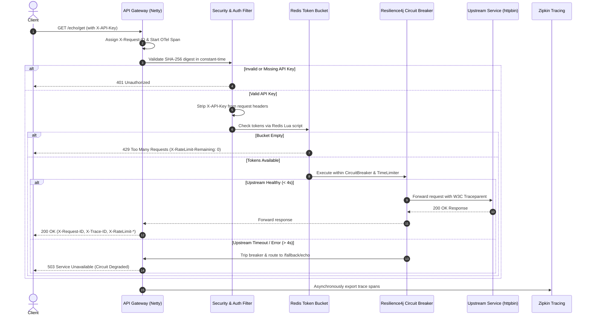

# Distributed API Rate Limiter & Resilient Gateway

[](https://openjdk.org/projects/jdk/21/)
[](https://spring.io/projects/spring-boot)
[](https://spring.io/projects/spring-cloud)
[](https://redis.io/)
[](https://resilience4j.readme.io/)
[](https://opentelemetry.io/)
[](LICENSE)

An enterprise-grade, non-blocking API Gateway built with **Spring Cloud Gateway (Project Reactor / Netty)**, distributed **Redis Token-Bucket Rate Limiting**, **Resilience4j Circuit Breaking & Timeouts**, **Zero-Trust Constant-Time SHA-256 Authentication**, and **Distributed Tracing (Micrometer + OpenTelemetry + Zipkin)**.

---

## 📑 Table of Contents

- [Overview & Architecture](#overview--architecture)
- [Business Logic Explained Simply](#business-logic-explained-simply)
- [Key Engineering Features](#key-engineering-features)
- [System Architecture Diagram](#system-architecture-diagram)
- [Quick Start with Docker Compose](#quick-start-with-docker-compose)
- [Step-by-Step API Testing Guide](#step-by-step-api-testing-guide)
  - [1. Happy Path Request (200 OK)](#1-happy-path-request-200-ok)
  - [2. Rate Limiting in Action (429 Too Many Requests)](#2-rate-limiting-in-action-429-too-many-requests)
  - [3. Zero-Trust Authentication Failures (401 Unauthorized)](#3-zero-trust-authentication-failures-401-unauthorized)
  - [4. Circuit Breaker & Timeout Fallback (503 Service Unavailable)](#4-circuit-breaker--timeout-fallback-503-service-unavailable)
  - [5. Actuator Health Probes & RBAC](#5-actuator-health-probes--rbac)
  - [6. Distributed Tracing in Zipkin](#6-distributed-tracing-in-zipkin)
- [Configuration Reference](#configuration-reference)
- [Generating API Keys and Hashes](#generating-api-keys-and-hashes)
- [Project Directory Structure](#project-directory-structure)
- [Automated Testing & Quality Suite](#automated-testing--quality-suite)
- [Deep-Dive Documentation](#deep-dive-documentation)

---

## Overview & Architecture

Modern distributed systems and microservice architectures face significant reliability threats:
1. **Noisy Neighbor Problems**: A single tenant can overwhelm shared downstream microservices with runaway traffic.
2. **Cascading Failures**: Slow downstream APIs cause connection pool exhaustion, starving the entire platform.
3. **Credential Sprawl & Leaks**: Upstream services accidentally receiving, caching, or logging plaintext API keys.
4. **Visibility Blindspots**: Lack of cross-service correlation identifiers when tracking distributed latency spikes.

This gateway acts as an intelligent protective shield positioned in front of your microservices, delivering sub-millisecond rate enforcement, fault isolation, and full lifecycle request observability without blocking OS threads.

---

## Business Logic Explained Simply

### 1. The Token Bucket Metaphor (Rate Limiting)
Imagine a movie theater entrance that accepts a maximum flow of visitors:
- Every tenant receives their own **bucket** that can hold up to **10 tokens** (`burstCapacity = 10`).
- Every second, an automatic dispenser adds **5 new tokens** to the bucket (`replenishRate = 5`).
- When a user makes an API call, they must hand over **1 token** to pass.
- If requests arrive at a steady 5 requests/sec, the bucket never runs out.
- If a burst of 10 requests arrives simultaneously, all 10 are served immediately by consuming the reserve tokens.
- Any request arriving while the bucket is completely empty is immediately turned away with **`429 Too Many Requests`**.

### 2. The Circuit Breaker Metaphor (Fault Tolerance)
Like an electrical circuit breaker in your home that trips when current spikes to prevent a fire:
- **CLOSED (Normal State)**: Requests flow freely to the downstream service. The gateway tracks success/failure rates over a sliding window of the last 10 requests.
- **OPEN (Tripped State)**: If 50% or more calls fail or take longer than 4.0 seconds to respond, the breaker trips **OPEN**. Rather than letting requests pile up and hang your infrastructure, the gateway instantly fast-fails all subsequent traffic with a structured **`503 Service Unavailable`** fallback.
- **HALF-OPEN (Testing Recovery)**: After a cooling period (10 seconds), the circuit allows a small number of trial requests through. If they succeed, the breaker resets to **CLOSED**. If any fail, it stays **OPEN**.

### 3. Zero-Trust Key Hashing (Constant-Time Security)
- **Why hashes?** We never store, compare, or transmit plaintext API keys. Only the cryptographic **SHA-256 digest** is configured in the gateway.
- **Why constant-time comparison?** Standard text comparisons (`stringA == stringB`) exit early on the first mismatched letter. Malicious hackers can measure nanosecond differences in server response times to guess keys character-by-character (a *timing attack*). We compare hashes using `MessageDigest.isEqual()`, which takes the exact same number of CPU cycles regardless of whether zero or all bytes match.
- **Upstream Credential Stripping**: The gateway authenticates the client at the edge and deletes the `X-API-Key` header before proxying the request downstream. Internal microservices never see or log API keys.

---

## Key Engineering Features

- **Non-Blocking Reactive Engine**: Powered by Spring Cloud Gateway on Netty and Project Reactor. Thousands of concurrent requests are handled by a small, fixed number of event-loop threads.
- **Atomic Distributed Rate Limiting**: Token bucket state is maintained in Redis using atomic **Lua scripts**, ensuring consistency even when the gateway is scaled horizontally across multiple instances.
- **Two-Layer Timeout Defense**:
  - *Layer 1*: Reactor Netty HTTP client response timeout ceiling (5,000ms).
  - *Layer 2*: Resilience4j TimeLimiter (4,000ms) tightly coupled with the Circuit Breaker.
- **Distributed Tracing & Context Propagation**:
  - Implements **Micrometer Tracing** with the **OpenTelemetry** bridge and **Zipkin** reporter.
  - Automatically preserves trace context across Netty thread switches via `Hooks.enableAutomaticContextPropagation()`.
  - Stamps inbound and outbound requests with W3C-compliant `traceparent` headers and echoes `X-Request-ID` and `X-Trace-ID` on all client responses.
- **Hardened Actuator & Role-Based Access Control**:
  - Unauthenticated clients see only minimal health status (`{"status":"UP"}`).
  - Internal metrics, Prometheus scraping, route mappings, and circuit breaker events require HTTP Basic authentication (`ROLE_ACTUATOR`).
- **Container-Optimized Production Image**:
  - Multi-stage Dockerfile built on Alpine Linux and Eclipse Temurin 21 JRE.
  - Configured with Java 21 Generational Z Garbage Collector (`-XX:+UseZGC -XX:+ZGenerational`) for ultra-low latency pauses (<1ms).

---

## System Architecture Diagram



---

## Quick Start with Docker Compose

### Prerequisites
- [Docker](https://docs.docker.com/get-docker/) (Engine 24+)
- [Docker Compose](https://docs.docker.com/compose/) (v2+)
- *Optional for local build*: Java 21 JDK and Maven 3.9+

### 1. Clone & Configure Secrets
Clone the repository and initialize your local environment configuration:

```bash
git clone https://github.com/ramantiw45/api-rate-limiter.git
cd api-rate-limiter

# Copy template secrets
cp .env.example .env
```

The preconfigured `.env` comes ready out-of-the-box with development credentials:
- **Default API Key**: `my-secure-api-key`
- **Actuator Username**: `actuator`
- **Actuator Password**: `SuperSecretActuatorPass123!`

### 2. Build and Start the Entire Stack
Run Docker Compose in detached mode. This builds the multi-stage gateway image, starts Redis with persistent storage, and boots the Zipkin distributed tracing server:

```bash
docker compose up --build -d
```

### 3. Verify Container Health
Check that all three containers are healthy:

```bash
docker compose ps
```

Expected output:
```
NAME                   IMAGE                      STATUS                    PORTS
rate-limiter-gateway   api-rate-limiter-gateway   Up (healthy)              0.0.0.0:8080->8080/tcp
rate-limiter-redis     redis:7-alpine             Up (healthy)              0.0.0.0:6379->6379/tcp
rate-limiter-zipkin    openzipkin/zipkin:3        Up (healthy)              0.0.0.0:9411->9411/tcp
```

---

## Step-by-Step API Testing Guide

### 1. Happy Path Request (200 OK)
Send an authenticated request through the gateway to the `/echo/**` route. The gateway strips prefix `/echo`, validates the key, deducts a rate-limit token, attaches distributed trace headers, and proxies to upstream:

```bash
curl -i -H "X-API-Key: my-secure-api-key" http://localhost:8080/echo/get
```

**Expected Response Headers & Body**:
```http
HTTP/1.1 200 OK
X-RateLimit-Remaining: 9
X-RateLimit-Requested-Tokens: 1
X-RateLimit-Burst-Capacity: 10
X-RateLimit-Replenish-Rate: 5
X-Request-ID: 1aad7a23-88b4-4f28-be0b-f2fac98aeeb2
X-Trace-ID: 4a3bfbcc4a31cbf2dbacf63800e65da7
Content-Type: application/json

{
  "headers": {
    "Traceparent": "00-4a3bfbcc4a31cbf2dbacf63800e65da7-67db477f5c78ca1c-01"
  },
  "url": "https://localhost:8080/get"
}
```
*Notice how `X-API-Key` is completely absent from the upstream request body, while standard W3C `Traceparent` and correlation headers were added.*

---

### 2. Rate Limiting in Action (429 Too Many Requests)
Simulate a burst of requests exceeding the bucket capacity (10 tokens) using PowerShell or Bash:

```bash
# Rapidly fire 15 requests
for i in {1..15}; do
  curl -s -o /dev/null -w "%{http_code}\n" -H "X-API-Key: my-secure-api-key" http://localhost:8080/echo/get
done
```

**Output**:
```
200
200
... (10 requests succeed)
429
429
429
```

When rate-limited, the gateway returns:
```http
HTTP/1.1 429 Too Many Requests
X-RateLimit-Remaining: 0
X-Request-ID: c54f738b-fa3b-48ae-94a1-5d9c22881b2d
X-Trace-ID: ed03a985d82084c8fb27da259d64f260
```

---

### 3. Zero-Trust Authentication Failures (401 Unauthorized)

#### Missing Header
```bash
curl -i http://localhost:8080/echo/get
```
```http
HTTP/1.1 401 Unauthorized
Content-Type: application/json

{"timestamp":"2026-09-05T17:45:00Z","status":401,"error":"Unauthorized","message":"Missing X-API-Key header"}
```

#### Invalid / Tampered Key
```bash
curl -i -H "X-API-Key: invalid-key-attack" http://localhost:8080/echo/get
```
```http
HTTP/1.1 401 Unauthorized
Content-Type: application/json

{"timestamp":"2026-09-05T17:45:05Z","status":401,"error":"Unauthorized","message":"Invalid API key"}
```

---

### 4. Circuit Breaker & Timeout Fallback (503 Service Unavailable)
Test the Resilience4j TimeLimiter by calling an upstream endpoint with artificial latency greater than our 4.0-second limit:

```bash
# Request upstream to delay response by 5 seconds
curl -i -H "X-API-Key: my-secure-api-key" http://localhost:8080/echo/delay/5
```

The gateway interrupts the call after 4,000ms and invokes `FallbackController`:
```http
HTTP/1.1 503 Service Unavailable
Content-Type: application/json
X-Request-ID: 8c1c4f52-4752-4740-8b1b-9f935ee5a1df
X-Trace-ID: 7a86f1e319fa3ec9c5f8dfb1580d8a57

{
  "timestamp": "2026-09-05T17:45:10.123Z",
  "status": 503,
  "error": "Service Unavailable",
  "message": "The upstream echo service is experiencing high latency or failure. Request degraded by gateway circuit breaker.",
  "path": "/fallback/echo"
}
```

---

### 5. Actuator Health Probes & RBAC

#### Public Unauthenticated Health Probe (Kubernetes Liveness / Readiness)
```bash
curl -i http://localhost:8080/actuator/health
```
```json
{"status":"UP"}
```

#### Authenticated Deep Health Probe
Inspect Redis connectivity, disk status, and circuit breaker states:
```bash
curl -i -u actuator:SuperSecretActuatorPass123! http://localhost:8080/actuator/health
```
```json
{
  "status": "UP",
  "components": {
    "circuitBreakers": {
      "status": "UP",
      "details": {
        "echoCircuitBreaker": {
          "status": "UP",
          "details": {
            "state": "CLOSED",
            "failureRate": "0.0%"
          }
        }
      }
    },
    "redis": {
      "status": "UP",
      "details": {
        "version": "7.4.2"
      }
    }
  }
}
```

#### Scrape Prometheus Metrics
```bash
curl -s -u actuator:SuperSecretActuatorPass123! http://localhost:8080/actuator/prometheus | grep resilience4j_circuitbreaker
```

---

### 6. Distributed Tracing in Zipkin

Every incoming request generates a distributed trace exported to Zipkin:
1. Open your browser and navigate to **[http://localhost:9411](http://localhost:9411)**.
2. Click the **Run Query** button.
3. Select any trace to view the interactive waterfall timeline detailing:
   - Request ingress at Netty server
   - Security filter chain execution
   - Token bucket calculation
   - Outbound Netty client latency to `httpbin.org`
   - Span tags containing `gateway.client_id`, `gateway.request_id`, and `http.status_code`.

---

## Configuration Reference

The application is configured through `application.yml` and overridable via standard environment variables:

| Environment Variable | Default Value | Description |
| :--- | :--- | :--- |
| `API_KEY_SHA256_HASHES` | *(local dev key digest)* | Comma-separated list of accepted 64-character SHA-256 API key digests. |
| `ACTUATOR_USERNAME` | `actuator` | Username required for privileged Actuator endpoints. |
| `ACTUATOR_PASSWORD` | `change-me-local-only` | Password for privileged Actuator endpoints. |
| `REDIS_HOST` | `localhost` | Hostname of the Redis cache/token store (`redis` in Docker). |
| `REDIS_PORT` | `6379` | Port for Redis connection. |
| `MANAGEMENT_ZIPKIN_TRACING_ENDPOINT` | `http://localhost:9411/api/v2/spans` | URL endpoint for exporting OpenTelemetry spans to Zipkin. |
| `ECHO_UPSTREAM_URI` | `https://httpbin.org` | Target upstream URL for the `/echo/**` route. |

---

## Generating API Keys and Hashes

To onboard a new tenant or generate production credentials:

```bash
# 1. Generate a strong random key (give this to the client)
NEW_KEY=$(openssl rand -hex 32)
echo "Client API Key: $NEW_KEY"

# 2. Generate the SHA-256 hash (store this in .env or cloud secret manager)
printf "$NEW_KEY" | sha256sum | awk '{print $1}'
```

Update your `.env` file with the resulting hash:
```env
API_KEY_SHA256_HASHES=0b21665133000ed0918be369efd62a7886b5b382afba0a66ca7adfe88340d9e8,another_hash_here
```

---

## Project Directory Structure

```
api-rate-limiter/
├── .env.example                               # Template for secrets and credentials
├── docker-compose.yml                         # Orchestration: Gateway, Redis 7, Zipkin 3
├── Dockerfile                                 # Multi-stage container build (JDK 21 + JRE 21)
├── pom.xml                                    # Dependencies (Spring Boot 3.3.4, OTel, Resilience4j)
├── docs/                                      # In-depth technical guides
│   ├── architecture.md                        # Filter execution, thread model & state machines
│   └── security-model.md                      # Constant-time auth, timing attacks & RBAC
└── src/
    ├── main/
    │   ├── java/com/api/ratelimiter/
    │   │   ├── ApiRateLimiterApplication.java # Bootstrap & Reactor context propagation
    │   │   ├── config/
    │   │   │   ├── CircuitBreakerProperties.java # Type-safe resilience configuration
    │   │   │   ├── GatewaySecurityProperties.java # Record for auth & actuator properties
    │   │   │   ├── KeyResolverConfig.java     # Tenant identity resolution (Key/IP fallback)
    │   │   │   ├── RateLimiterConfig.java     # Customizer beans for RedisRateLimiter
    │   │   │   ├── ResilienceConfig.java      # Resilience4j Reactive Customizer
    │   │   │   └── SecurityConfig.java        # Spring Security Reactive filterchain & RBAC
    │   │   ├── controller/
    │   │   │   └── FallbackController.java    # Reactive 503 circuit-breaker fallback handler
    │   │   ├── filter/
    │   │   │   ├── ApiKeyValidationFilter.java# Constant-time validation & header stripping
    │   │   │   ├── GlobalLoggingFilter.java   # Distributed tracing, MDC, X-Request-ID stamping
    │   │   │   └── RateLimitErrorFilter.java  # Structured 429 response formatting
    │   │   └── security/
    │   │       ├── ApiKeyHasher.java          # Utility for SHA-256 hashing & fingerprinting
    │   │       └── ApiKeyValidator.java       # Constant-time MessageDigest validator
    │   └── resources/
    │       └── application.yml                # Master route definitions, timeouts & observability
    └── test/
        ├── java/com/api/ratelimiter/
        │   ├── ApiKeyValidationFilterTest.java# Unit tests for key parsing and validation
        │   ├── ApiRateLimiterApplicationTests.java # Context loading & filterchain tests
        │   ├── CircuitBreakerTimeoutTest.java # MockServer tests for timeouts and tripping
        │   ├── DistributedTracingIntegrationTest.java # OTel spans and traceparent propagation
        │   └── SecurityIntegrationTest.java   # RBAC & constant-time auth verification
        └── resources/
            └── application-test.yml           # Test profile with accelerated timeouts
```

---

## Automated Testing & Quality Suite

The project includes an integration test suite validating every tier of the architecture. Tests spin up simulated upstreams with WireMock/MockWebServer and execute full reactive end-to-end assertions.

Execute all unit and integration tests:

```bash
mvn clean verify
```

### Coverage Highlights
- **`SecurityIntegrationTest`**: Verifies anonymous actuator allowlists, RBAC challenges on metrics, and 401 rejection on malformed or missing keys.
- **`CircuitBreakerTimeoutTest`**: Simulates slow backends, verifying that timeouts trip precisely at threshold limits and recover cleanly when traffic stabilizes.
- **`DistributedTracingIntegrationTest`**: Verifies that Micrometer creates valid 128-bit trace IDs, stamps MDC context across Netty event loops, and echoes `X-Trace-ID` in HTTP responses.
- **`ApiKeyValidationFilterTest`**: Unit-tests constant-time byte comparisons, whitespace trimming, and oversized payload rejections.

---

## Deep-Dive Documentation

For engineers seeking deeper technical specifics on internal implementations:
- 📖 [**System Architecture & Internals**](docs/architecture.md): In-depth reactive execution lifecycle, filter ordering rationale, and Redis Lua script mechanics.
- 🛡️ [**Security Architecture & Threat Model**](docs/security-model.md): Detailed timing-attack analysis, zero-downtime key rotation, and defense-in-depth mitigations.

---

## License

This project is licensed under the Apache License 2.0. See the [LICENSE](LICENSE) file for details.
