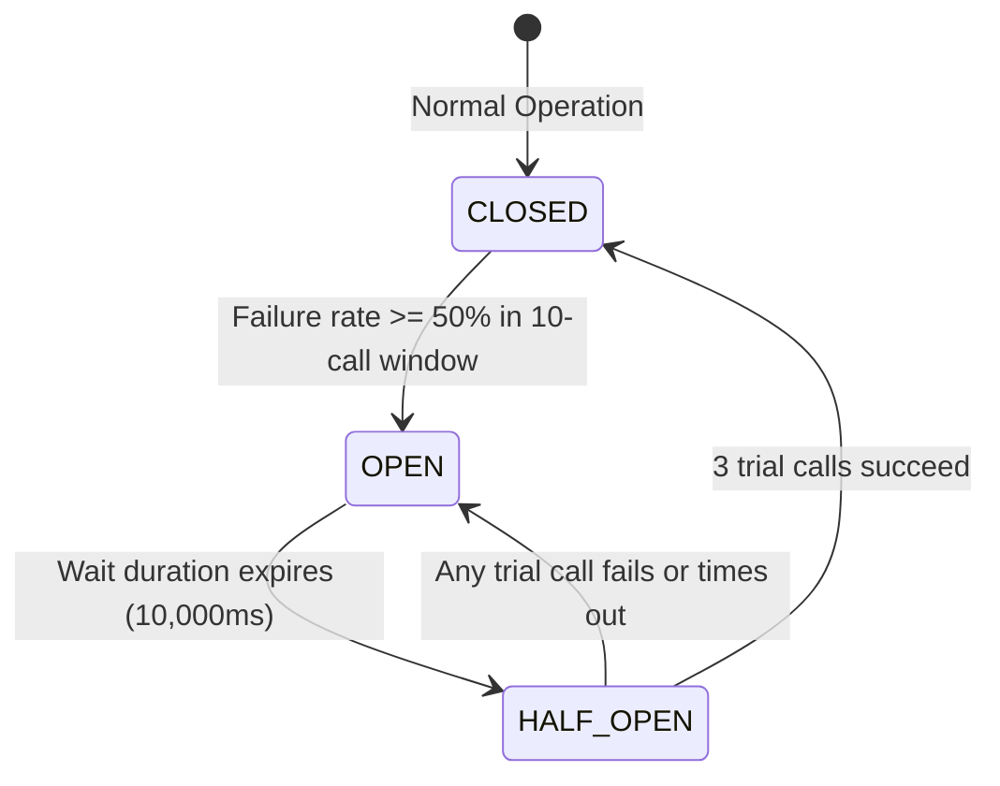

# System Architecture & Internals

This document provides an in-depth technical analysis of the internal mechanics, filter execution lifecycle, concurrency model, and distributed resilience strategies implemented in the API Rate Limiter Gateway.

---

## 1. Architectural Overview

The gateway acts as an edge reverse proxy situated between public traffic and upstream backend services. It is constructed using a non-blocking, event-driven reactive runtime rather than traditional servlet-based thread-per-request models.

```
                   ┌──────────────────────────────────────────────┐
                   │               Inbound Traffic                │
                   └──────────────────────┬───────────────────────┘
                                          │
                                          ▼
                   ┌──────────────────────────────────────────────┐
                   │    Netty Event Loop (Reactor Netty Server)   │
                   └──────────────────────┬───────────────────────┘
                                          │
                                          ▼
                   ┌──────────────────────────────────────────────┐
                   │         Spring Security WebFilter            │
                   │  - Anonymous allowlist (/actuator/health)    │
                   │  - HTTP Basic Auth for Actuator endpoints    │
                   └──────────────────────┬───────────────────────┘
                                          │
                                          ▼
                   ┌──────────────────────────────────────────────┐
                   │  GlobalLoggingFilter (Order: HIGHEST_PREC.)  │
                   │  - Extracts / generates X-Request-ID         │
                   │  - Resolves active OpenTelemetry TraceId     │
                   │  - Tags trace span (clientId, requestId)     │
                   │  - Hooks beforeCommit() response headers     │
                   └──────────────────────┬───────────────────────┘
                                          │
                                          ▼
                   ┌──────────────────────────────────────────────┐
                   │ ApiKeyValidationFilter (Order: HIGHEST + 2)  │
                   │  - Extracts X-API-Key                        │
                   │  - Computes SHA-256 digest                   │
                   │  - Constant-time verification (MessageDigest)│
                   │  - Strips X-API-Key before upstream forward  │
                   └──────────────────────┬───────────────────────┘
                                          │
                                          ▼
                   ┌──────────────────────────────────────────────┐
                   │       Spring Cloud Gateway Route Matching    │
                   │       Route: /echo/** -> https://httpbin.org │
                   └──────────────────────┬───────────────────────┘
                                          │
                                          ▼
                   ┌──────────────────────────────────────────────┐
                   │   StripPrefix GatewayFilter (parts = 1)      │
                   │   /echo/get  ──►  /get                       │
                   └──────────────────────┬───────────────────────┘
                                          │
                                          ▼
                   ┌──────────────────────────────────────────────┐
                   │      RequestRateLimiter GatewayFilter        │
                   │  - KeyResolver: SHA-256 hashed API key or IP │
                   │  - Redis Token Bucket via atomic Lua script  │
                   │  - If tokens < 1: emit HTTP 429 Too Many Req │
                   └──────────────────────┬───────────────────────┘
                                          │ (If tokens available)
                                          ▼
                   ┌──────────────────────────────────────────────┐
                   │        Resilience4j CircuitBreaker           │
                   │  - Sliding window evaluation (10 calls)      │
                   │  - Failure rate threshold (50%)              │
                   │  - TimeLimiter timeout (4000ms)              │
                   │  - Fallback forward: /fallback/echo (503)    │
                   └──────────────────────┬───────────────────────┘
                                          │ (If Circuit CLOSED/HALF_OPEN)
                                          ▼
                   ┌──────────────────────────────────────────────┐
                   │      Downstream Netty HTTP Client            │
                   │  - Connect timeout (2000ms)                  │
                   │  - Response timeout (5000ms ceiling)         │
                   │  - Injects W3C traceparent correlation header│
                   └──────────────────────┬───────────────────────┘
                                          │
                                          ▼
                   ┌──────────────────────────────────────────────┐
                   │          Upstream Backend Service            │
                   └──────────────────────────────────────────────┘
```

---

## 2. Filter Ordering & Separation of Concerns

Filter ordering is critical in an edge gateway. Misconfigured filter precedence can lead to security vulnerabilities, false-positive metrics, or performance degradation.

| Order Index | Component | Category | Purpose |
| :--- | :--- | :--- | :--- |
| `Ordered.HIGHEST_PRECEDENCE` (`-2147483648`) | `GlobalLoggingFilter` | Global Filter | Initiates request timing, extracts/creates correlation IDs (`X-Request-ID`, `X-Trace-ID`), binds tracing tags to the active Micrometer span, and registers `beforeCommit()` hooks. |
| `Ordered.HIGHEST_PRECEDENCE + 1` (`-2147483647`) | `RateLimitErrorFilter` | Global Filter | Intercepts empty HTTP 429 responses generated by `RequestRateLimiter` and writes a standardized JSON error body. |
| `Ordered.HIGHEST_PRECEDENCE + 2` (`-2147483646`) | `ApiKeyValidationFilter` | Global Filter | Enforces zero-trust API key authentication before route processing. Strips the credential header to prevent upstream credential leakage. |
| Per-Route Filter #1 | `StripPrefixGatewayFilterFactory` | Gateway Filter | Normalizes the URI path before forwarding to upstreams. |
| Per-Route Filter #2 | `RequestRateLimiterGatewayFilterFactory` | Gateway Filter | Atomic Redis token bucket evaluation. Short-circuits with 429 if the bucket is exhausted. |
| Per-Route Filter #3 | `SpringCloudCircuitBreakerFilterFactory` | Gateway Filter | Wraps the downstream execution in a Resilience4j circuit breaker and time limiter. |
| Built-in (Default) | `NettyRoutingFilter` / `ForwardPathFilter` | Routing | Dispatches outbound reactive HTTP request to the target URI. |

### Why RateLimiter Must Precede CircuitBreaker
If the `CircuitBreaker` filter wraps the `RequestRateLimiter`, any HTTP `429 Too Many Requests` returned by the rate limiter would be counted as an upstream failure by Resilience4j. During high load, legitimate rate limiting would trip the circuit breaker into the `OPEN` state, taking down service for all users. By placing `RequestRateLimiter` **before** `CircuitBreaker`, rate-limited requests are terminated immediately and never register as circuit breaker faults.

---

## 3. Distributed Rate Limiting via Redis Token Bucket

The gateway employs the **Token Bucket Algorithm** backed by Redis.

### Mathematical Model
- **Bucket Capacity ($B$)**: Maximum token burst capacity (e.g., 10 tokens).
- **Replenish Rate ($r$)**: Tokens refilled per second (e.g., 5 tokens/sec).
- **Requested Tokens ($C$)**: Cost per incoming request (1 token).

At request arrival time $t$:
$$\text{new\_tokens} = \min(B, \text{current\_tokens} + (t - \text{last\_replenish\_time}) \times r)$$

If $\text{new\_tokens} \ge C$:
$$\text{remaining\_tokens} = \text{new\_tokens} - C \quad \implies \quad \text{ALLOW (HTTP 200)}$$
$$\text{Else} \quad \implies \quad \text{REJECT (HTTP 429)}$$

### Atomic Execution with Redis Lua Scripts
To guarantee accuracy in horizontally scaled gateway clusters:
1. Evaluation and token decrements are packaged in an atomic Redis Lua script.
2. Redis executes Lua scripts as a single atomic unit, eliminating race conditions (check-then-act anomalies) across concurrent threads and multiple gateway instances.
3. Redis key structure:
   - `request_rate_limiter.{id}.tokens`: Current token count.
   - `request_rate_limiter.{id}.timestamp`: Epoch timestamp of last update.

---

## 4. Resilience & Fault Tolerance State Machine

The gateway enforces a two-layer defense-in-depth timeout and circuit breaking model:



### Layer 1: Reactor Netty Response Timeout (5000ms)
A low-level TCP/socket timeout configured on `HttpClient`. It acts as the final safety net preventing orphaned sockets from hanging indefinitely in the event of upstream network partitions.

### Layer 2: Resilience4j TimeLimiter (4000ms) & CircuitBreaker
Configured tighter than the Netty socket timeout:
- **Call Execution**: If downstream latency exceeds 4,000ms, `TimeLimiter` cancels the reactive subscription and triggers a `TimeoutException`.
- **Sliding Window**: Records results of the last 10 requests.
- **Trip Condition**: If $\ge 50\%$ of calls fail or time out (minimum 5 calls required), the breaker flips to `OPEN`.
- **Fast-Fail Fallback**: In the `OPEN` state, requests never hit the network. They fast-fail directly to `FallbackController.echoFallback()`, which returns:
  ```json
  {
    "timestamp": "2026-09-05T17:40:08.828Z",
    "status": 503,
    "error": "Service Unavailable",
    "message": "The upstream echo service is experiencing high latency or failure. Request degraded by gateway circuit breaker.",
    "path": "/fallback/echo"
  }
  ```

---

## 5. Reactive Thread Model & Context Propagation

```
  Netty EventLoop (Worker Thread)
           │
           ├──► [Exchange Received]
           │
           ├──► Hooks.enableAutomaticContextPropagation()
           │         │
           │         ▼
           │    Tracer Context Snapshot (TraceId / SpanId)
           │         │
           │         ├──► MDC Logging ([api-rate-limiter,traceId,spanId])
           │         │
           │         ├──► Reactor Schedulers (FlatMap / Map / Filter)
           │         │
           │         └──► Outbound Netty HTTP Client
           │                   │
           │                   ▼
           │             Traceparent Header (W3C Standard)
           │
           ▼
  [Non-blocking Response / Stream Completion]
```

### Automatic Context Propagation
Standard `ThreadLocal` storage fails in Project Reactor because reactive pipelines dynamically switch execution across various Netty event loops and worker schedulers. 

To bridge this gap:
1. `Hooks.enableAutomaticContextPropagation()` is invoked during gateway bootstrapping (`ApiRateLimiterApplication`).
2. Micrometer Tracing captures trace identifiers (`traceId`, `spanId`) and stamps them into Reactor's `ContextView`.
3. Whenever an operator dispatches work to another thread, the context is transparently copied into the active MDC logging context and restored upon completion.
